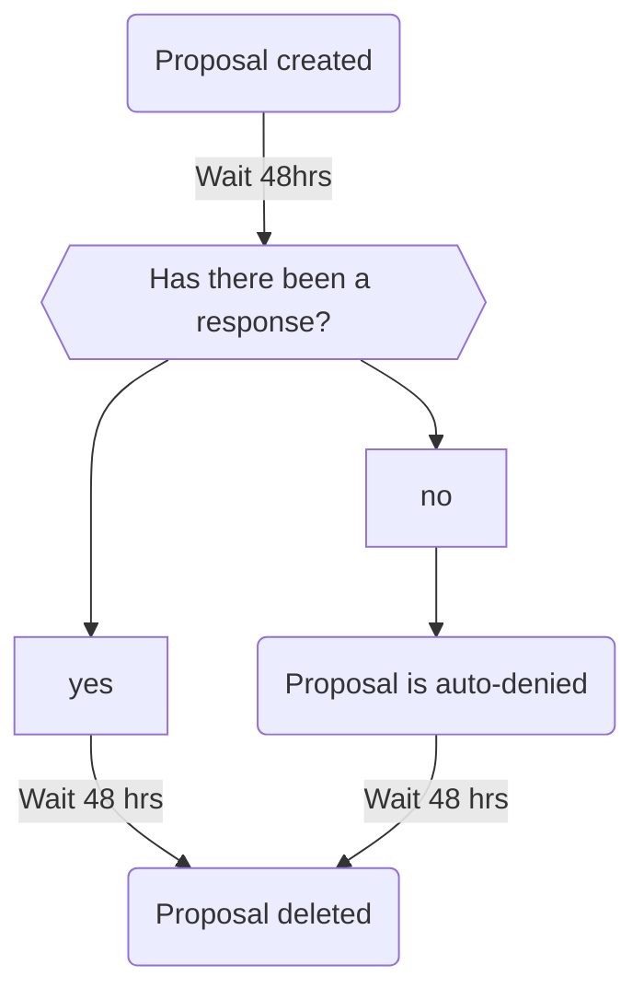

<style>
  .emoji{
    width: 24px; 
    height: 24px; 
    vertical-align: middle; 
    margin-left: 2px;
  }
</style>

<div align="center">
  
  <h1>A Better Marriage Bot</h1>
  <h4>A free to use, modern Discord bot for creating family's within Discord</h4>
</div>

<div align="center" styles="margin-top: 10px">

<a href="https://wakatime.com/badge/user/562ef0a6-af5f-4e3d-b92f-23fc331558ea/project/69edc26a-4fb3-4b79-8034-1e42674f983c"></a>

</div>

## Table Of Contents

- [Technical](#technical-️)
  - [sern Handler ](#sern-handler-)
  - [Databases ](#databases-)
    - [Neo4j ](#neo4j-)
    - [Mongodb ](#mongodb-)
  - [Graphing](#graphing-)
  - [Versioning](#versioning)
    - [Usable Flags](#usable-flags)
- [Usage Docs](#usage-docs)
  - [Proposals ](#proposals-)
    - [Lifetime](#lifetime)
  - [Incest Levels](#incest-levels-)
- [Future Plans](#-future-plans)
  - [Database \& Query Improvements](#-database--query-improvements)
  - [Relationship \& Interaction Features](#️-relationship--interaction-features)
  - [Seasonal Events \& Special Commands](#-seasonal-events--special-commands)
  - [Command \& System Enhancements](#️-command--system-enhancements)
  - [Premium Features](#-premium-features)


## Why?

- Supports poly relationships.
- Modern & Minimalistic 
- Made for speed

<!--
## Competitor Comparison

Have a table here with each major competitor and what their capable of and what we do better.
-->

# Technical 🛠️

## sern Handler 

Unionize has been written using the latest version of the [sern](https://sern.dev) bot framework. I've been a supporter of this framework for years and I highly recommend them for your next bot.

## Databases 

Unionize runs 2 databases consecutively for different purposes. Neo4j is used to store relationships between users and MongoDB is used for everything else.

### Neo4j 

**Modules will never access the N4j client directly** and therefor never handle or use cypher. All commands use the models created for them (N4jUser, N4jGuild, etc) or interact with the data interpreter.

### Mongodb 

Our use of MongoDB is less strict due to its already strong model like ecosystem. This allows commands to interact with the DB via these models.

## Graphing 📊

Family trees can be viewed with the `/tree` command. At the point of writing this, this command uses graphviz to render a pretty bad looking but great functionality graph. In future this will use D3 and a headless browser and look something like:


## Versioning

Unionize uses **semantic versioning** along with **pre release labels**. The format is followed:

```
{flag}-{major}.{minor}.{hotfix}
```

### Usable Flags

| **Version Name**    | **Flag** | **Description**                                                       |
| ------------------- | -------- | --------------------------------------------------------------------- |
| `stable`            | `s`      | Fully tested and production-ready release.                            |
| `alpha`             | `a`      | Early development version, unstable and may contain breaking changes. |
| `beta`              | `b`      | Feature-complete but may still contain bugs.                          |
| `release candidate` | `rc`     | Nearly stable but requires final testing.                             |

# Usage Docs

## Proposals 

### Lifetime

The lifetime of a proposal will work as followed:



## Incest Levels 👬

Use this table to understand what IL correlates to what relationships. Keep in mind only premium users can modify their IL.
| **IL Level** | **Allowed Relationships** | **Examples** |
|-------------|--------------------------|-------------|
| **0** (Strict) | No relatives at all | Only completely unrelated people can marry |
| **1** | Distant cousins (8th+ cousin, removed) | `"8th cousin 2 times removed"` |
| **2** | Moderate cousins (5th+ cousin) | `"5th cousin"`, `"5th cousin 1 time removed"` |
| **3** | Close cousins (3rd+ cousin) | `"3rd cousin"`, `"4th cousin"` |
| **4** | First cousins allowed | `"1st cousin"` |
| **5** | Sibling of spouse, grandnieces/nephews | `"niece/nephew"`, `"aunt/uncle"` |
| **6** | Siblings allowed | `"sibling"` |
| **7** | Parent-child, grandparent-grandchild allowed | `"parent"`, `"grandparent"` |

# 🚀 Future Plans

> These are ideas and planned features that are **likely** to be implemented but are **not yet confirmed**.

## 🔹 Database & Query Improvements

- Convert **predefined Cypher files** into **dynamically generated Cypher queries** in JavaScript.

  - Allows more flexible queries without needing to specify `ON CREATE` parameters every time.
  - Improves performance and adaptability.

- Future **command execution** should prioritize **models over the Neo4j Data Interpreter**:
  - A refined plugin should create **models** for the user executing the command.
  - These models will be accessible via **state** and have methods for easier data interaction.
  - Reduces dependency on direct database queries.

## ❤️ Relationship & Interaction Features

- **Love Levels**

  - Users will have **love levels** with anyone they are related to (directly or indirectly).
  - Love levels will be stored in a **MongoDB collection**.
  - Some **interact commands** may be **partner-only**.
  - **Love Level Decay**:
    - Love levels **slowly decrease** over time.
    - Decay rate can be **customized** (`/set-decay-rate`)—potentially a **premium feature**.
  - Love levels will affect **certain commands** (e.g., `/kiss` animations change based on love level).

- **Memory Book / Relationship Milestones**

  - Keeps track of key events like:
    - First kisses 💋
    - Adoptions 🏡
    - Marriage anniversaries 💍
  - This could be a **premium-only** feature.

- **Memories Feature (like Facebook Memories?)**

  - Sends reminders like:
    - `"It's your 3-month anniversary!"` 🎉
    - `"You've been married for 6 months!"` 🥳
    - Or a command `/relation-length` that checks how long you've had a relationship with a specified user.
      - Changes response or adds different emojis dependant on the relation.
  - Could be sent via **DMs** or appear when using relevant commands.
  - Possibly a **premium-only** feature.

- **Daily Challenges**
  - Example: `"Hug 3 members in your tree today!"`
  - Completing challenges could **increase love level** or earn **bonus rewards**.

## 🎉 Seasonal Events & Special Commands

- Introduce **seasonal or limited-time events**:
  - 🎃 **Halloween:** `/carve-pumpkin`
  - 🎄 **Christmas:** `/decorate-tree`
  - 💖 **Valentine’s Day:** Love level boosts
  - These events could **boost love levels** and encourage user engagement.

## 🛠️ Command & System Enhancements

- Implement **cooldowns** on certain commands.
- Determine if **premium features** should be **per-user or per-guild**.
  - If per-guild, admins could use `/set-decay-rate` for global settings.

## 🔹 Premium Features

- **Higher traversal depth** for **family trees**.
- **Lower decay rate** for **love levels**.
- **Exclusive seasonal events and memories.**

## Other
- Remove the language manager from global namespace. 
